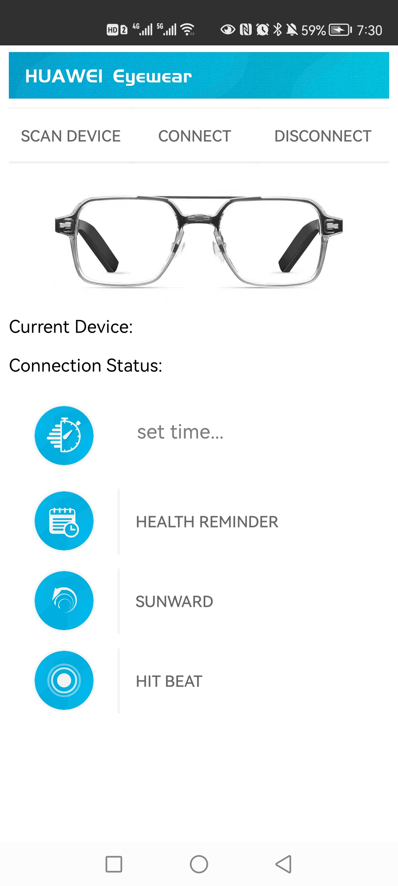
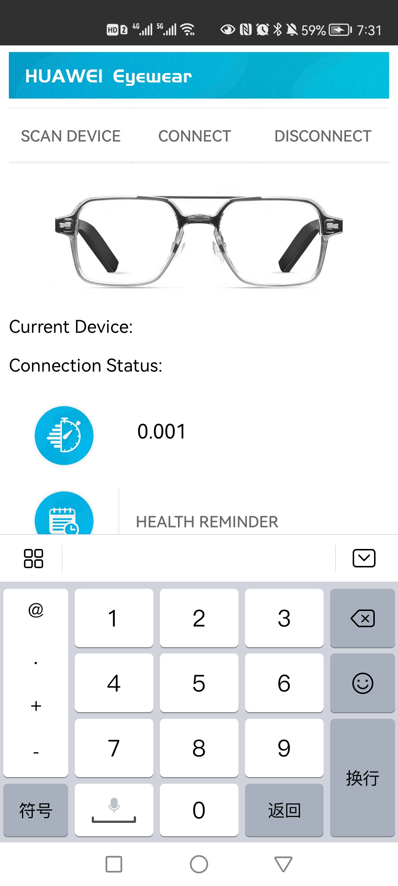
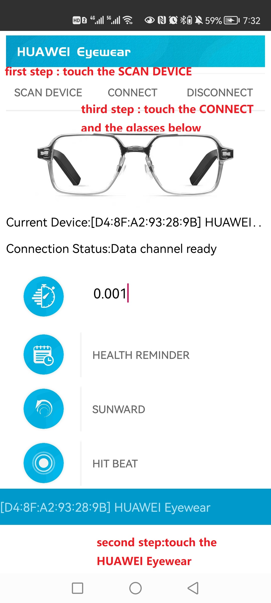
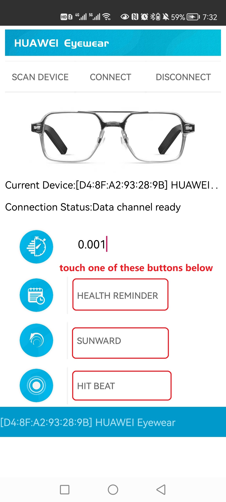

# Shaking

## 项目链接

1.PPT: 链接：https://pan.baidu.com/s/1ftNIi5Q_Uf6SUqJNkgILxg 
提取码：gdvf

2.Code: 链接：https://pan.baidu.com/s/1JkssHnutVY10rgSXJRmJZw 
提取码：r3v0

3.视频：链接： https://b23.tv/RSP9h3P

##  Team contribution

1.许超然  Xu Chaoran  3200105650

collecting data for processing, the main code implementation of the method of neck activities and application test.

2.朱思宇 Zhu Siyu  3190102779

figure out how to use MediaPlayer to play music;UI implementation and handle button/EditView logic.

3.尹培林 Yin Peilin 3200105215

The writing of the recordtime class, the writing of the basic framework of the program, and the improvement of the code.

4.张晓玉（线上同学）

Background and User Research, Wizard of OZ,  UI Design and Production Video Production.

## Software Description

the content below is the operating procedure of Shaking software.(The glasses must be connected to the mobile phone through the bluetooth to enable the use of subsequent software)

1. Enter the initialization interface：

   
   
2. Set reminder interval duration (in hours) : 

   

3. Enable data transfer

   

4. select mode 

   

5. switch mode : Just click on these three modes, you can easily switch the mode.

  
  
  After the above process, whenever you bow your head more than the time  you set, the software will remind you according to your mode. 